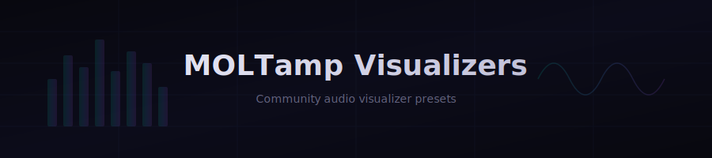

<div align="center">



<br/>

<a href="https://moltamp.com">
  
</a>

<br/><br/>

[](LICENSE)
[](#browse-presets)
[](VISUALIZERS.md)
[](https://moltamp.com/visualizers/)

**[Download MOLTamp](https://moltamp.com)** &nbsp;&middot;&nbsp; **[Authoring Guide](VISUALIZERS.md)** &nbsp;&middot;&nbsp; **[Contributing](CONTRIBUTING.md)**

</div>

<br/>

## What is MOLTamp?

MOLTamp wraps Claude Code's terminal in a skinnable cockpit UI — vibes panel, side panels, telemetry ticker, reactive animations. The **Visualizer widget** renders audio-reactive Canvas 2D animations driven by microphone input, beat detection, and the active skin's color palette.

> Pure Canvas 2D. No libraries. No WebGL. Full creative freedom.

<br/>

## Browse Presets

<table>
<tr>
<td align="center" width="25%">

**Bars**<br/>
<sub>Classic frequency bars with beat scaling</sub>

</td>
<td align="center" width="25%">

**Circle**<br/>
<sub>Radial frequency bars with gradient fill</sub>

</td>
<td align="center" width="25%">

**Spectrum**<br/>
<sub>Rainbow frequency bars split at midline</sub>

</td>
<td align="center" width="25%">

**Wave**<br/>
<sub>Dual waveform with glow on beat</sub>

</td>
</tr>
<tr>
<td align="center" colspan="4">

*Your preset here* &rarr; [submit a PR](#contributing)

</td>
</tr>
</table>

<br/>

## Install

```bash
# Clone and copy
git clone https://github.com/shoot-here/moltamp-visualizers.git
cp -r moltamp-visualizers/visualizers/circle ~/Moltamp/visualizers/
```

Or: **MOLTamp > Settings > Visualizers > Import** &rarr; select folder or `.zip`

<br/>

## Create a Preset

```
visualizers/my-preset/
  preset.json       <- manifest
  renderer.js       <- render function
```

### `preset.json`

```json
{
  "id": "my-preset",
  "name": "My Preset",
  "description": "What it looks like in one sentence.",
  "author": "Your Name",
  "dataType": "frequency"
}
```

### `renderer.js`

```js
module.exports = function(ctx, data, W, H, colors, beat) {
  var bars = Math.min(data.length, 48);
  var bw = W / bars;
  for (var i = 0; i < bars; i++) {
    var h = (data[i] / 255) * H * (1 + beat.decay * 0.2);
    ctx.fillStyle = data[i] > 200 ? colors.red : colors.accent;
    ctx.fillRect(i * bw + 1, H - h, bw - 2, h);
  }
};
```

### The Render Function

| Arg | Type | Description |
|-----|------|-------------|
| `ctx` | `CanvasRenderingContext2D` | Drawing context (2x Retina scaled) |
| `data` | `Uint8Array` | Audio data — frequency bins (0-255) or waveform samples |
| `W`, `H` | `number` | Canvas size in CSS pixels |
| `colors` | `object` | Skin palette: `accent`, `dim`, `magenta`, `cyan`, `green`, `red`, `yellow`, `blue` |
| `beat` | `object` | Beat state: `energy`, `peak`, `isBeat`, `decay` (0-1, smooth falloff) |
| `waveData` | `Uint8Array?` | Waveform data (only when `dataType` is `"both"`) |

> **Full spec:** [VISUALIZERS.md](VISUALIZERS.md) &mdash; every argument, advanced techniques, AI prompt block, performance tips.

<br/>

## Guidelines

| # | Guideline |
|---|-----------|
| 1 | Use `colors.*` from skin palette — no hardcoded hex |
| 2 | Reset `globalAlpha`, `shadowBlur` at end of render |
| 3 | Cap loops: `Math.min(data.length, 64)` |
| 4 | No DOM, no `require`/`import` — pure Canvas 2D |
| 5 | No unbounded state (arrays growing each frame) |
| 6 | Target 60fps — keep the render function tight |

<br/>

## Beat Reactivity

`beat.decay` is your best friend — it jumps to 1 on each beat and smoothly falls back to 0. Multiply it into sizes, alphas, and blur radii for smooth pulsing:

```js
var lineWidth = 1.5 + beat.decay * 2;      // Thickens on beat
ctx.shadowBlur = beat.decay * 10;           // Glow pulses
var scale = 1 + beat.decay * 0.15;          // Subtle size pulse
```

<br/>

## Using AI

Point ChatGPT, Claude, or Codex at [VISUALIZERS.md](VISUALIZERS.md) — it has a ready-to-paste prompt block in the **"For AI-Generated Presets"** section with the full render function spec.

<br/>

## Contributing

1. Fork this repo
2. Create `visualizers/your-preset-id/` with `preset.json` + `renderer.js`
3. [Open a PR](../../pulls)

See [CONTRIBUTING.md](CONTRIBUTING.md) for the full guide and checklist.

<br/>

<div align="center">

<a href="https://moltamp.com">
  
</a>

<br/>

<sub>Made for the community by <a href="https://moltamp.com">MOLTamp</a></sub>

</div>
